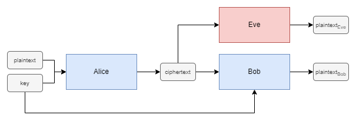
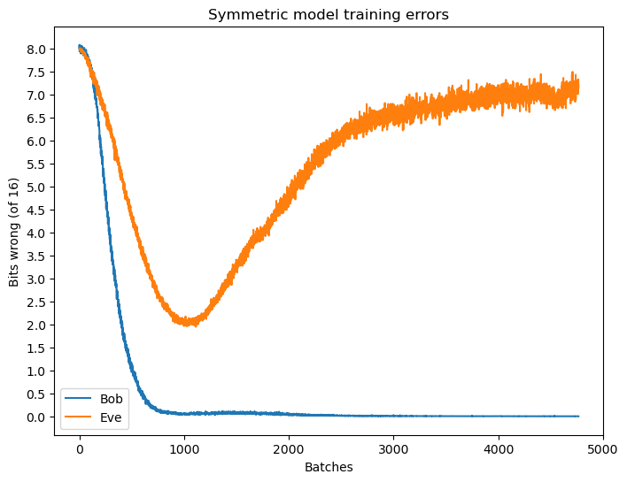
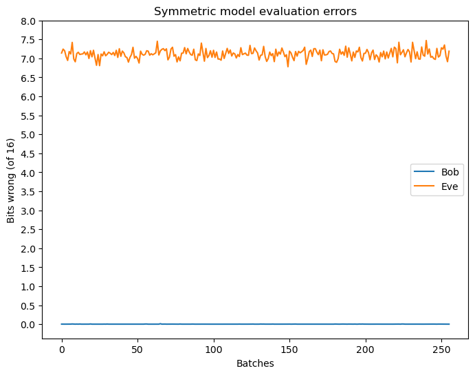
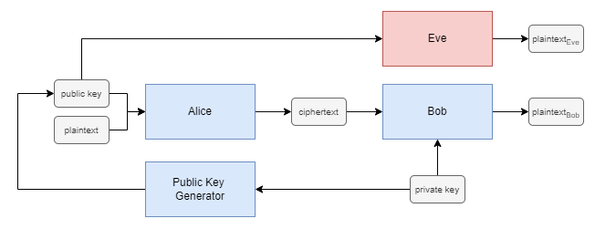
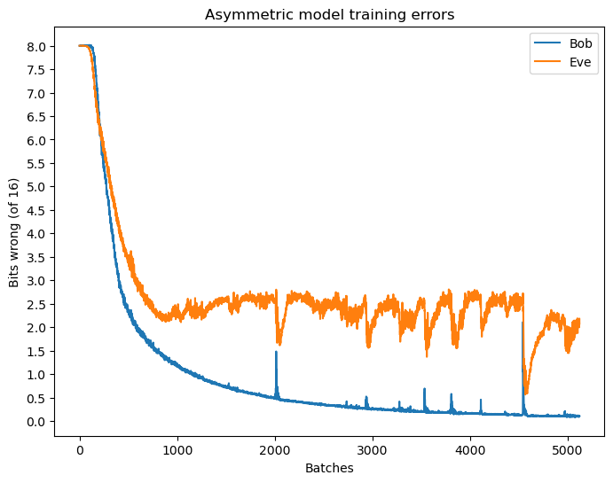
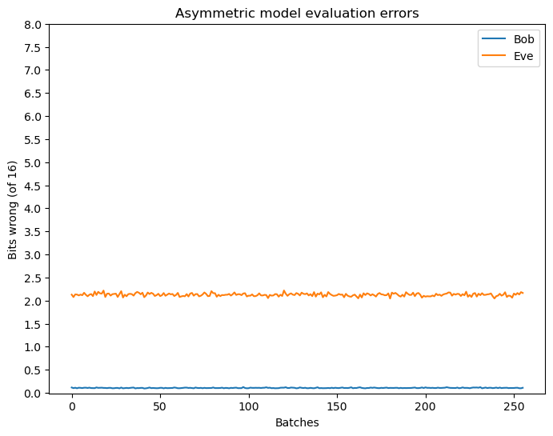

# Adversarial Neural Cryptography

## Overview

In 2016, Abadi and Anderson introduced a novel approach for learning encryption schemes using neural networks, termed Adversarial Neural Cryptography [[1]](https://arxiv.org/pdf/1610.06918.pdf).

It was shown that neural networks can learn to protect their communication from an adversary by means of self-discovered encryption mechanisms. By training adversarially, two neural networks aiming to communicate privately learn to perform encryption and decryption, ensuring confidentiality in the presence of eavesdroppers. This was achieved without prescribing initial cryptographic algorithms.

The code in this repository aims to implement a simplified version of this system, and demonstrate the ability for neural networks to learn encryption and decryption algorithms, albeit impractical ones.

## Introduction

Suppose we have two agents, Alice and Bob, who wish to communicate securely over a public channel with a secret key. An eavesdropper, Eve, is listening in on the channel as a passive attacker where they can only intercept communications and not inject or modify messages in transit. The goal is for Alice and Bob to learn to communicate privately, keeping their messages confidential from Eve.

The scenario is presented in Figure 1, showing the flow of information between the three agents as neural networks. Alice and Bob are the communicating agents, and Eve is the eavesdropper.

<div align="center">
    
    <p>Figure 1. Symmetric model of Adversarial Neural Cryptography.</p>
</div>

Whilst Alice and Bob may start out poorly, even sending the original plaintext message, over time they learn how to obscure the message from Eve whilst maintaining effective communication by incorporating the secret key into their messages.

Note that while Eve aims to minimise their own error rate, the primary function of this neural network is to challenge Alice and Bob during training as an adversary, guiding them to enhance the security of their communication.

## Implementation

### Inputs

The inputs to the neural networks, either a plaintext message, a key, or a ciphertext, will be a sequence of bits of fixed length. Rather than using 0 and 1 to represent the individual values, we shall instead use -1 and 1. We will also assume one fresh key per plaintext message for encryption.

### Neural Networks Architecture

Continuing with the initial specification, Alice, Bob and Eve all share the same neural network structure. They each have an initial dense layer, followed by a series of convolutions. This is a so-called "mix and transform" architecture. The significance of this architecture was for the neural networks to learn which bits to combine by first mixing the plaintext and key bits, and then learning how to transform groups of these mixed bits.

### Loss Functions

At a high level, Alice and Bob want to have a high accuracy in their communication, while maximising the error rate of Eve. However, if we are not careful, maximising the error of Eve would allow the possibility of Eve simply flipping all bits in the next step to remove all error.  Instead, we do not attempt to maximise the reconstruction error, but aim to make Eve produce answers indistinguishable from a random guess.

At the same time, Eve wants to minimise their own error rate.

### Training

To train the system, we update the weights of the neural networks according to the loss function applied over batches of data. Training alternates between Alice/Bob and Eve, with Alice/Bob training for one batch, and then Eve for two batches. This ratio was selected to provide Eve with a slight computational advantage, consistent with the original paper.

As is common in training neural networks, we update the weights of the neural network after every batch instead of every sample, this is to train the system faster, and to reduce the amount of data we have to hold in memory.
Training will persist until we either reach the designated number of training epochs or until Alice and Bob surpass a prespecified minimum loss threshold.

## Evaluation

From training we have the reconstruction errors of both Bob and Eve, as shown in Figure 2.

<div align="center">
    
    <p>Figure 2. Training reconstruction errors of Bob and Eve.</p>
</div>

Initially, Alice and Bob quickly reduce their communication error, yet Eve also recovers a respectful portion of the plaintext message. Soon after, the error of Eve steadily increases, indicating that Alice and Bob are beginning to incorporate the key to obscure the plaintext, simultaneously preserving their level of communication.

Note also how, for bit sequences of length 16, at worst the neural networks still recover around 8 bits, half of the original in this case. This is to be expected, a random guess would on average yield half the correct bits. As mentioned when discussing the objectives of the neural networks, we want Eve to do no better than random guessing.

Evaluating the system with a new dataset shows the final accuracies achieved when the neural networks are no longer actively updated, see Figure 3.

<div align="center">
    
    <p>Figure 3. Final reconstruction errors of Bob and Eve.</p>
</div>

In practice, Alice and Bob can often achieve communication errors much less than 0.05 bits of error, and though Eve operates close to random guessing, still manages to recover 1 or 2 bits of the original message.

## Asymmetric Adversarial Neural Cryptography

Expanding upon the symmetric model, we introduce an asymmetric model by incorporating a key generator neural network. This neural network operates alongside Alice and Bob to generate public keys, accessible to all agents within the system. In contrast to the symmetric model, where a single shared key handles encryption and decryption, the asymmetric model employs public-private key pairs. Both Alice and Eve use a public key generated by the key generator, produced using the private key of Bob. Subsequently, Bob uses the private key corresponding to the public key used by Alice to decrypt the ciphertext. The asymmetric model is depicted in Figure 4.

<div align="center">
    
    <p>Figure 4. Asymmetric model of Adversarial Neural Cryptography.</p>
</div>

This key generator undergoes training alongside Alice and Bob, following the same alternating training strategy as the symmetric model. Figure 5 shows the training errors of Bob and Eve in the asymmetric model.

<div align="center">
    
    <p>Figure 5. Training reconstruction errors of Bob and Eve in the asymmetric model.</p>
</div>

And as before, we evaluate the system with a new dataset to determine the final accuracies achieved when the neural networks are no longer actively updated, see Figure 6.

<div align="center">
    
    <p>Figure 6. Final reconstruction errors of Bob and Eve in the asymmetric model.</p>
</div>

The performance of the asymmetric model is notably worse than that of the symmetric model, with Eve recovering a majority of the plaintext message. This is likely due to the increased complexity of the asymmetric model, where the key generator neural network introduces additional noise into the system. Despite this, it still demonstrates the capability of neural networks to learn some form of weak security over communication channels.

## Demonstration

A simple demonstration of encryption and decryption using the symmetric model is provided below:

```
# Symmetric model
Plaintext: Hello, World!
Ciphertext: ?÷Qgsã?ÿì»`:
Plaintext (Bob): Hello, World!
Plaintext (Eve): !á8)ªhØCuî¸Q
```

And the asymmetric model:

```
# Asymmetric model
Plaintext: Hello, World!
Ciphertext: 6G6 _N&
Plaintext (Bob): Hello, World!
Plaintext (Eve): Xe|l, Wv|d!
```

## References

1. Martín Abadi and David G. Andersen. *Learning to Protect Communications with Adversarial Neural Cryptography.* 2016. [arXiv:1610.06918](https://arxiv.org/abs/1610.06918).
